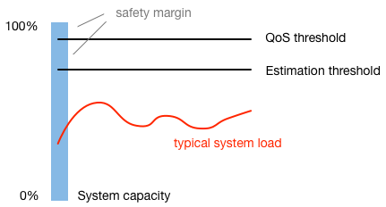

Threshold-based Mesos Oversubscription
======================================

[](https://github.com/blue-yonder/mesos-threshold-oversubscription/blob/master/LICENSE)
[](https://travis-ci.org/blue-yonder/mesos-threshold-oversubscription)

This repository contains two simple
[Mesos oversubscription](http://mesos.apache.org/documentation/latest/oversubscription/) modules:

* `ThresholdResourceEstimator`: Informs the Mesos master about resources that can be oversubscribed
  on the associated agent.

  Similar to the `fixed` resource estimator provided by Mesos, it allows operators to configure a
  fixed amount of oversubscribable revocable resources per agent. However, once system utilization
  reaches a defined threshold, resources will be cut to the currently used amount, avoiding further
  scheduling of revocable tasks.

* `ThresholdQoSController`: Informs the Mesos agent that particular corrective actions need to be
  made to prevent quality-of-service violations (i.e. system overload).

  Following the same principle as the `ThresholdResourceEstimator`, corrective actions are taken
  whenever the system utilization reaches a configurable threshold. The controller kills one
  revocable task per iteration and thus slowly corrects resource estimations that turned out to be
  over-optimistic.


Is it any good?
---------------

The threshold-based approach enabled us to double the CPU and memory utilization in our
Mesos/Aurora clusters. Your mileage may vary, so please take this statement with a grain of salt.


Mechanics
---------

Resource estimator and QoS controller aim to work in unison to ensure that the system utilization
is never approaching critical levels that could negativly affect non-revocable tasks.



Revocable resources will only be offered if the system utilization remains below the estimation
threshold. If utilization spikes above, no more revocable resources are offered. If it further
surpasses the QoS threshold, the controller will begin to kill revocable tasks until the
utilization drops. Assuming the utilization drops below the QoS but not below the estimation
threshold, the freed resources will not be re-offered, thus preventing further overload of the host.


Installation
------------

This project uses CMake. Build requires Mesos development headers and a compatible version of GCC.
The Vagrant file in this repository creates a proper build environment for Debian Jessie.

Build and installation follow the usual CMake tripplet. You can use the CXX and CC environment
variable to ensure that a compatible compiler is selected.

    mkdir -p build
    cd build
    cmake ..
    make
    make test
    make install


Configuration
-------------

The estimator and controller implementations assume the Mesos agent is using the following isolation
mechanims:

```bash
--isolation=cgroups/cpu,cgroups/mem  # enable cgroup isolation and accounting
--revocable_cpu_low_priority         # run revocable tasks with minimal CPU shares
--cgroups_enable_cfs                 # enforce upper limit of usable CPU shares
                                     # (optional but recommended)
```

To enable the oversubscription modules, launch the Mesos agent with the following flags. The given
example assumes you have a host with 256000 MB RAM and 40 CPUs that you want to oversubscribe with
at most 96000 MB RAM and 16 cores:

```json
--resource_estimator="com_blue_yonder_ThresholdResourceEstimator"
--qos_controller="com_blue_yonder_ThresholdQoSController"
--oversubscribed_resources_interval=15secs
--qos_correction_interval_min=15secs

--modules='{
  "libraries": {
    "file": "/<path>/<to>/libthreshold_oversubscription.so",
    "modules": [
      {
        "name": "com_blue_yonder_ThresholdResourceEstimator",
        "parameters": [
          { "key": "resources",
            "value": "cpus:16;mem:96000"},
          { "key": "load_threshold_1min",
            "value": "64"},
          { "key": "load_threshold_5min",
            "value": "48" },
          { "key": "load_threshold_15min",
            "value": "32" },
          { "key": "mem_threshold",
            "value": "200000"}
        ]
      },
      {
        "name": "com_blue_yonder_ThresholdQoSController",
        "parameters": [
          { "key": "load_threshold_5min",
            "value": "60" },
          { "key": "load_threshold_15min",
            "value": "40" },
          { "key": "mem_threshold",
            "value": "230000"}
        ]
      }
    ]
  }
}'
```

Make sure to set the memory thresholds low enough so that the operating system can maintain
sufficiently large file buffers and caches. This will also prevent the Linux OOM from being
triggered which could potentially kill a non-revocable task.

By default, a Mesos framework receives only non-revocable resources. An explicit opt-in is
required to receive revocable resources as well. For example, for
[oversubscription with Apache Aurora](https://github.com/apache/aurora/blob/master/docs/features/resource-isolation.md#oversubscription)
the following scheduler flags are required:

```bash
-receive_revocable_resources  # opt-in for revocable resource offers
-enable_revocable_cpus        # schedule revocable jobs using revocable CPU resources
-enable_revocable_ram         # schedule revocable jobs using revocable RAM resources
```


Known Limitations
-----------------

The main design goals of the threshold modules was a simple, stateless implementation.
This comes with a few limitations:

* Being based on coarse-grained load and memory thresholds, the oversubscription technique described
  here might not be suitable for aggressive oversubscription on systems with very latency sensitive
  services. If you have such a requirement, either be very conservative or have a look at
  [Intel/Mesosphere Serenity](https://github.com/mesosphere/serenity).

* If you run your agents with `--cgroups_enable_cfs` you need at least a Linux kernel 3.8 or later.
  Otherwise the system `load` used by estimator and QoS controller will not correctly account for
  throttled processes. Further details can be found in this
  [LWN article](https://lwn.net/Articles/531853/).

* When the CPU is overloaded, a random un-revocable task is killed rather than the most aggressive
  one.

We may feel compelled to address some of these limitations in the future.
Pull requests are welcome as well :-)


License
-------

This repository is licensed under the [Apache License, Version 2.0](http://www.apache.org/licenses/LICENSE-2.0).

